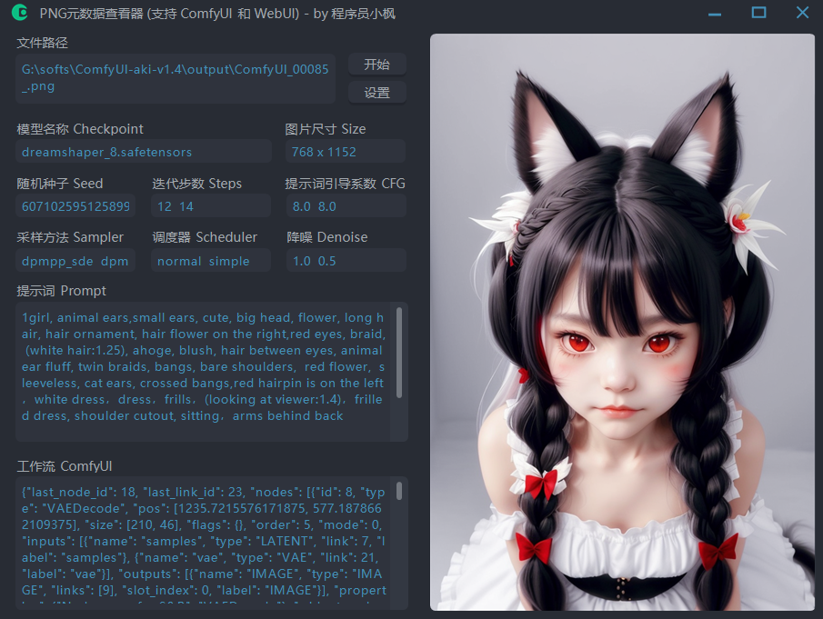
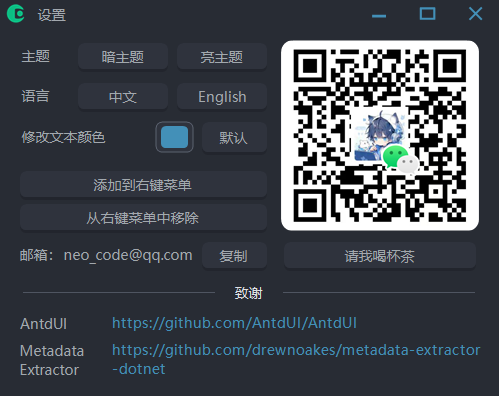
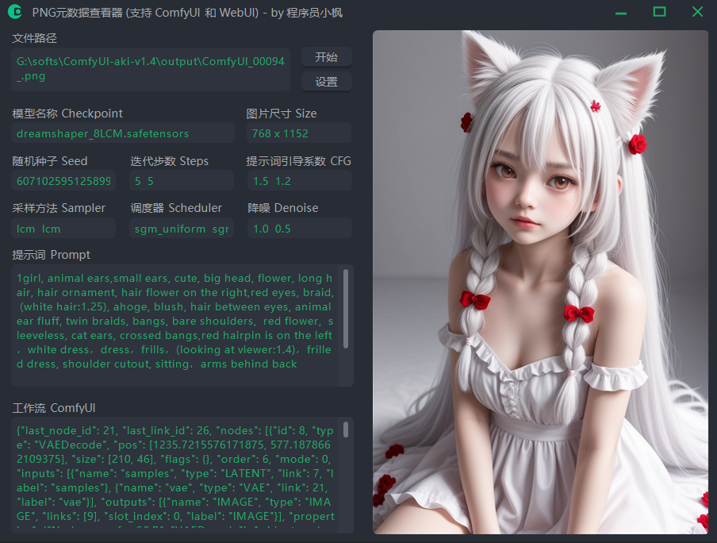
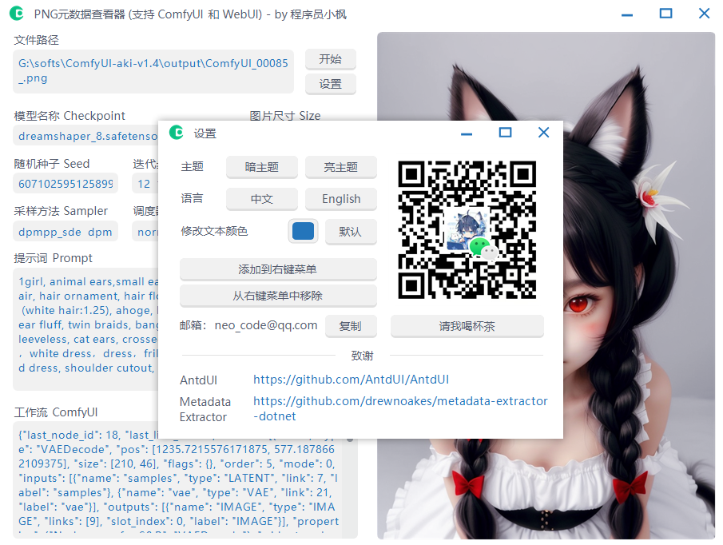
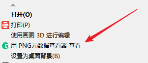

# PNGMetadataViewer
查看 PNG 图片的元数据，`ComfyUI` 和 `WebUI` 生成的`原始`图片都可以。

> 只显示了一些比较重要的参数。

## 截图

**备注：**
1. 截图里面，迭代步数 Steps、提示词引导系数 CFG 等有多个值，原因是在 ComfyUI 中添加了多个节点。

## 使用方法

1.**直接把图片拖放的软件界面就可以了。**

2.点击`设置`可以切换主题和语言

3.设置那里还可以在右键菜单添加 “用 PNG 元数据查看器 查看” 选项

